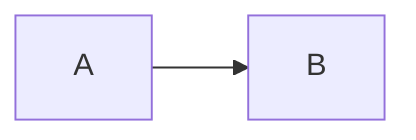

# Blog

Markdown posts → static HTML with auto TOC, rich media, and SEO.

## Add a post

1. Create `blog/posts/my-slug.md`:

```markdown
---
title: Your title
description: One or two sentences for SEO and the listing page.
date: 2026-07-14
updated: 2026-07-14
tags: [meetly, macos]
image: ./assets/my-slug/og.png
author: codeonholiday
draft: false
---

## First section

Your content…
```

2. Put images/GIFs in `blog/posts/assets/my-slug/`.
3. Run `npm run build:blog` (or push to `main` — deploy workflow builds automatically).

### SEO checklist (frontmatter)

| Field | Required | Notes |
|-------|----------|--------|
| `title` | yes | Becomes `<h1>` + `<title>` |
| `description` | yes | Meta description + OG/Twitter |
| `date` | yes | Published date |
| `image` | recommended | OG/Twitter share image (1200×630 ideal) |
| `updated` | optional | `dateModified` + sitemap `lastmod` |
| `tags` | optional | `article:tag` + keywords |
| `draft` | optional | `true` skips publish/sitemap |

## Media syntax

**Image / GIF**

```markdown

```

**YouTube**

```markdown
:::youtube https://www.youtube.com/watch?v=VIDEO_ID
:::
```

**Mermaid**

````markdown

````

## URLs

- Listing: `/blog/`
- Post: `/blog/my-slug/`
- RSS: `/blog/feed.xml`
