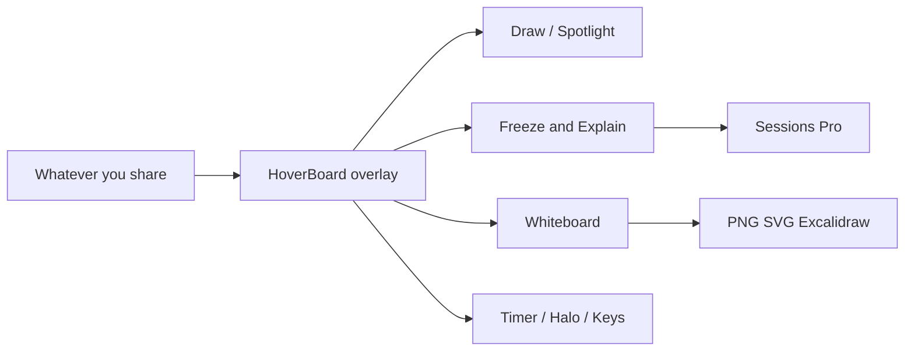
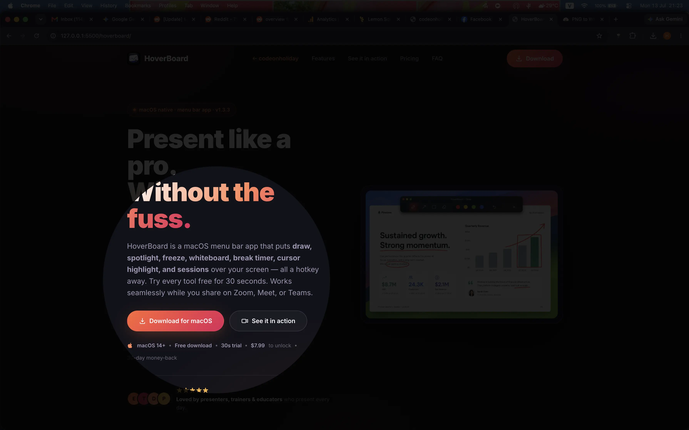
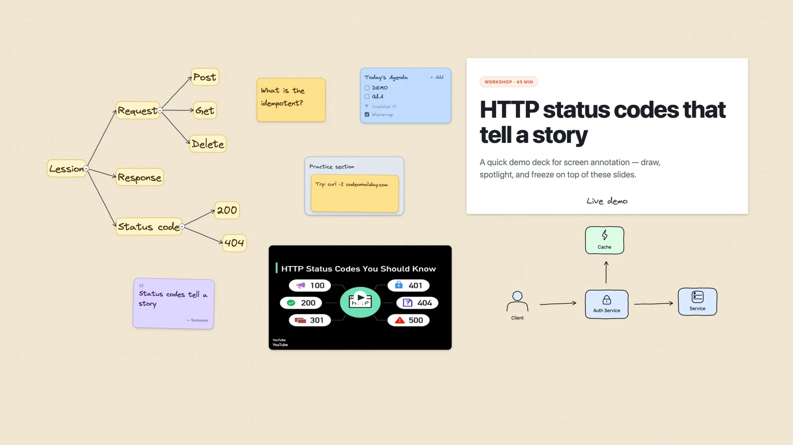
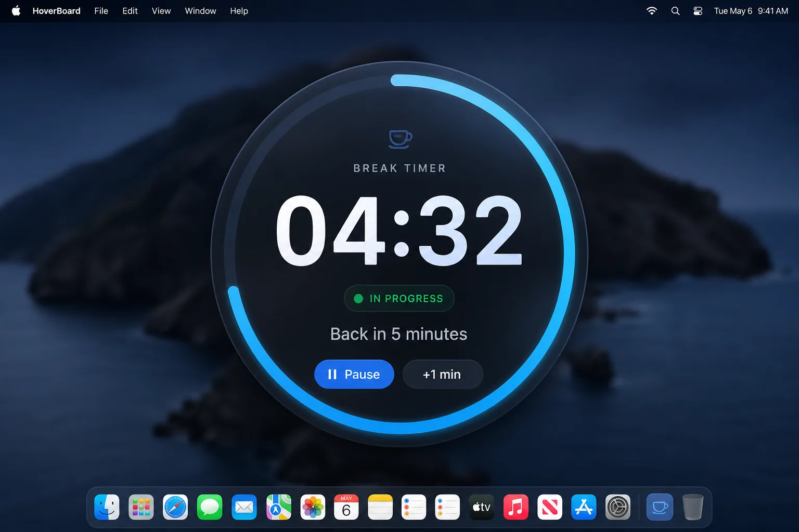
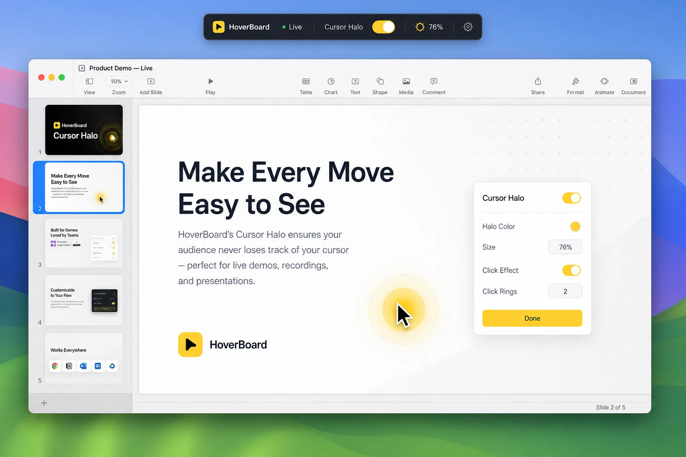
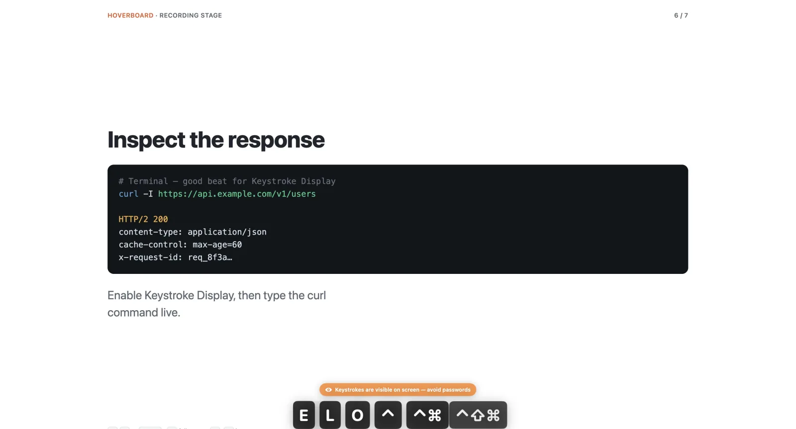
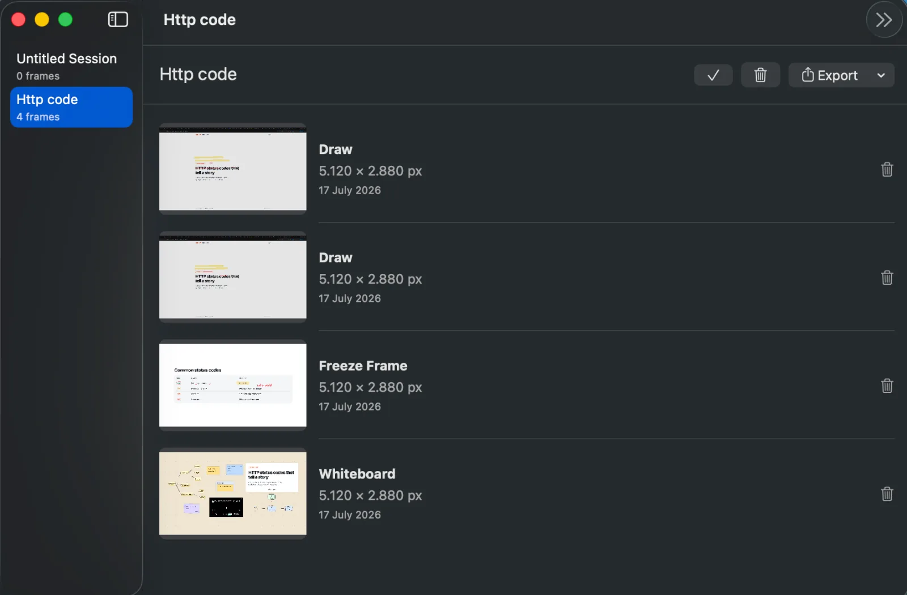

HoverBoard is a native macOS **menu bar** app that puts a presentation layer over whatever you are already sharing — slides, a browser, an IDE, or a video call. It is not a slide deck app and not a cloud whiteboard. You summon tools with a hotkey, teach, then dismiss with Esc.

This guide covers install, every mode, whiteboard collage tools, keyboard shortcuts, free vs Pro, Stream Deck URLs, and troubleshooting. Download from the [HoverBoard page](/hoverboard/) if you have not already.

## See it in action

A quick tour of the overlay in a real presenting flow:

:::youtube https://youtu.be/DgMY9qRFxFI
:::


> Demo updated for recent builds — landing screenshots for whiteboard, keystroke, and sessions match the current UI.

## What HoverBoard does (and does not do)

**HoverBoard does:**

- Draw and annotate over any screen while you share
- Spotlight a soft hole around the cursor
- Freeze a frame and explain at your own pace
- Open an infinite local whiteboard (mindmap, sticky notes, checklists, polaroids, and more)
- Run a break timer overlay
- Highlight the cursor and show live keystrokes
- Take a region or full-display screenshot with copy, save, and markup
- Record the screen to MP4 with mic/system audio and a post-record editor
- Keep private Markdown notes with live preview and Mermaid diagrams
- Capture frames into Sessions and export PNG / PDF (Pro)

**HoverBoard does not:**

- Replace Keynote, PowerPoint, or Google Slides
- Upload your screen or boards to our servers — everything stays on your Mac
- Require a subscription — Free covers core tools forever; Pro is a one-time purchase



## Requirements

- **macOS 14 (Sonoma) or later**
- Enough disk for a lightweight native app (not Electron)
- **Accessibility** permission for global hotkeys and Keystroke Display (macOS will prompt when needed)
- **Screen Recording** permission for Freeze, Screenshot, and Screen Record
- **Microphone** permission when Screen Record captures your mic

## Install and first launch

1. [Download HoverBoard](/hoverboard/) and unzip the archive.
2. Drag **HoverBoard.app** into Applications (or run it from the folder).
3. On first open, macOS may ask you to confirm — choose **Open**.
4. HoverBoard lives in the **menu bar** (top-right). There is no persistent Dock icon after launch.

> **Opened HoverBoard and nothing happened?** Click the HoverBoard icon in the menu bar. If you do not see it, check the menu bar overflow (» or Control Center extras).

**Tip:** On Pro, enable **Launch at login** in Settings so overlays are ready after every reboot.

## Modes walkthrough

Open any mode from the menu bar or with the **⌃⌥** leader key (Control + Option) plus a letter. Press **Esc** to close the current mode.

### Draw — 60s Pro trial

Read the dedicated [Draw guide](/blog/how-to-use-hoverboard-draw/) for the full tool and shortcut reference.

Annotate live over whatever is on screen: pen, arrow, rectangle, number markers, eraser, pan, colors, optional auto-fade, undo/clear.


Default hotkey: **⌃⌥D**

Draw runs at full power for a 60-second preview each time you open it. Pro unlocks unlimited drawing and annotation.

### Spotlight — free forever

Read the dedicated [Spotlight guide](/blog/how-to-use-hoverboard-spotlight/) for radius, darkness, feathering, and click-through tips.

Dim the screen and put a soft spotlight around the cursor. Click-through stays enabled so you can keep presenting.



Default hotkey: **⌃⌥S**

### Freeze & Explain — 60s Pro trial

Read the dedicated [Freeze guide](/blog/how-to-use-hoverboard-freeze/) for screen capture permissions and Session capture.

Snapshot the screen, then annotate the frozen frame. Ideal when the UI is about to change under you. Save frames to Sessions on Pro.


Default hotkey: **⌃⌥F**

### Whiteboard — 60s Pro trial

Read the dedicated [Whiteboard guide](/blog/how-to-use-hoverboard-whiteboard/) for mindmaps, widgets, architecture stencils, and exports.

Private infinite canvas with shapes, freehand, text, connectors, mindmaps, teaching widgets (sticky, checklist, polaroid, media links), and **architecture stencils** for system-design diagrams. Export PNG, SVG, or Excalidraw.



Default hotkey: **⌃⌥W**

### Break Timer — free forever

Read the dedicated [Break Timer guide](/blog/how-to-use-hoverboard-break-timer/) for fullscreen, minimal, chimes, and live controls.

Countdown overlay for breaks. Fullscreen or minimal, custom message, optional chime, pause / +1 minute.



Default hotkey: **⌃⌥T**

### Screenshot — free forever

Read the dedicated [Screenshot guide](/blog/how-to-use-hoverboard-screenshot/) for region capture, full-display shortcuts, and the editor.

Drag a region or press Space/Enter for the full display. After capture, use **Copy**, **Save**, or **Edit** (crop, pen, arrow, rectangle, text) from the HUD.

Default hotkey: **⌃⌥G**

### Screen Record — free forever

Read the dedicated [Screen Record guide](/blog/how-to-use-hoverboard-screen-record/) for capture modes, the record pill, and the trim/speed editor.

Choose **Full Screen**, **Selection**, or **Window**, then record with mic and system audio toggles on the floating pill. **Finish** opens the editor — trim with Keep/Split/Delete, change speed (up to 10×), crop, then Save or Save As. This is screen capture to MP4, not [Notes meeting recording](/blog/how-to-use-hoverboard-recording/).

Default hotkey: **⌃⌥V**

### Cursor Halo — 60s Pro trial

Read the dedicated [Cursor Halo guide](/blog/how-to-use-hoverboard-cursor-halo/) for pointer visibility and click feedback.

Animated halo and click feedback so viewers can follow your pointer.



Default hotkey: **⌃⌥H**

### Keystroke Display — 60s Pro trial

Read the dedicated [Keystroke Display guide](/blog/how-to-use-hoverboard-keystroke-display/) before enabling keyboard monitoring.

Show live keystrokes on screen while you present or record. The first time you enable it, HoverBoard asks for a **privacy confirmation**. Esc closes the overlay.

Default hotkey: **⌃⌥K**



### Notes — 60s Pro trial

Keep speaker notes in a local Markdown library with live preview, Mermaid diagrams, folders, search, autosave, Popup / Full screen presentation, and PDF export. Notes are **Private** by default and stay hidden from screen sharing until you choose **Sharing**.

Default hotkey: **⌃⌥N**. Read the dedicated [Notes guide](/blog/how-to-use-hoverboard-notes/) for the privacy workflow and presenter mode.

### Sessions — Pro

Read the dedicated [Sessions guide](/blog/how-to-use-hoverboard-sessions/) for capture, reorder, and export workflows.

Save frames from Draw, Freeze, or Whiteboard into a local library. Reorder, rename, export PNG set or multi-page PDF.



## Whiteboard deep dive

### Mindmap

- **Tab** — add a child node  
- **Return** — add a sibling  
- **⌘⇧L** — arrange the tree (tree or radial)  
- Collapse a branch when the board gets busy; drag a collapsed subtree as one unit  
- New children inherit the parent’s color and style  
- Start from **Lesson Outline** or **Concept Map** templates when available  

### Teaching widgets

Drop these from the toolbar / Annotation menu — they sit on the same infinite canvas as shapes and mindmaps.

- **Paper** — background color plus patterns (dots, grid, lines, graph, isometric).  
- **Sticky note** — pastel note for a question or reminder.  
- **Callout** — speech-style card for a shout-out.  
- **Checklist** — interactive todos with an Add row (great for agendas).  
- **Frame** — titled region to group related content.  
- **Quote** — attributed quote card.  
- **Polaroid** — photo with an editable caption under the frame.  
- **Media link** — paste or drop a YouTube / video / audio URL; the card shows a poster and plays **inline** on the board (you can move and resize while it plays).
- **Highlight box / Redaction / Step badge** — call out a region, redact a strip, or mark a numbered step on a screenshot.

### Architecture stencils (system design)

From the stencil menu, drop ready-made blocks for architecture diagrams — connect them with arrows like any other shape:

- **Compute** — Web App, Service, Auth Service, Client/User, Worker  
- **Data** — Database, PostgreSQL, Cache, Redis, Object Storage  
- **Messaging** — Queue, Event Stream  
- **Network** — Load Balancer, API Gateway, External API, CDN  
- **Infrastructure** — Cloud, Region/VPC, Kubernetes/Cluster  

Use these when you sketch a backend or product topology mid-call instead of drawing boxes from scratch.

The properties panel only shows controls that apply to the current selection. Multi-select drag moves the whole selection without grouping first.

### Export

Export the board to **PNG**, **SVG**, or **Excalidraw** when you want the artifact in slides or another editor.

## Keyboard shortcuts

### Leader key (global)

Default leader is **⌃⌥** (remappable modifiers in Settings) + letter:

| Key | Mode |
|-----|------|
| **D** | Draw |
| **S** | Spotlight |
| **F** | Freeze |
| **W** | Whiteboard |
| **T** | Break Timer |
| **G** | Screenshot |
| **V** | Screen Record |
| **H** | Cursor Halo |
| **K** | Keystroke Display |
| **N** | Notes |
| **Esc** | Close current mode (does not stop an active Screen Record — use **Finish** on the pill) |

### In Draw / Freeze

| Key | Action |
|-----|--------|
| **Shift+P** | Pan |
| **B** | Pen |
| **Shift+A** | Arrow |
| **Shift+R** | Rectangle |
| **N** | Number marker |
| **E** | Eraser |
| **1–4** | Colors |
| **U** / **Shift+U** | Undo / redo |
| **X** | Clear |
| **C** | Copy |
| **Shift+S** | Save |
| **R** | Reset viewport |

### Break Timer

| Key | Action |
|-----|--------|
| **P** | Pause / resume |
| **M** | Add one minute |

## Free vs Pro

| | Free forever | 60s trial / Pro |
|--|--------------|-----------------|
| Draw | Yes | — |
| Spotlight | Yes | — |
| Break Timer | Yes | — |
| Screenshot | Yes | — |
| Screen Record | Yes | — |
| Freeze | — | Trial, then Pro |
| Whiteboard | — | Trial, then Pro |
| Cursor Halo | — | Trial, then Pro |
| Keystroke Display | — | Trial, then Pro |
| Notes | — | Trial, then Pro |
| Sessions, unlimited overlays, export/copy, command URLs, launch at login | — | Pro |

While a Pro trial is running, a countdown pill shows remaining seconds (for example `Pro trial · 60s`). When it ends, reopen for another preview or buy a license from Settings / the [pricing section](/hoverboard/#pricing).

Pro is a **one-time purchase** (launch pricing on the product page), not a subscription. 30-day money-back guarantee.

## Stream Deck and command URLs

HoverBoard registers the `hoverboard://` URL scheme for automation (Stream Deck, Alfred, shortcuts):

```sh
open "hoverboard://activate/draw"
open "hoverboard://activate/spotlight"
open "hoverboard://activate/freeze"
open "hoverboard://activate/whiteboard"
open "hoverboard://activate/timer"
open "hoverboard://activate/screenshot"
open "hoverboard://activate/record"
open "hoverboard://activate/halo"
open "hoverboard://activate/keys"
open "hoverboard://activate/notes"
open "hoverboard://toggle/screenshot"
open "hoverboard://toggle/record"
open "hoverboard://stop"
```

Tool and color actions also exist (`hoverboard://action/tool/pen`, `…/color/red`, undo, clear, timer-pause, and more). Full list: see the app’s COMMANDS docs or Settings. **Screenshot** and **Screen Record** URLs work on the free tier; most other command URLs require **Pro** (or an active 60-second trial while an overlay is open).

## HoverBoard vs Presentify-class tools

Apps like **Presentify** are excellent at annotate, cursor highlight, spotlight, and often **screen zoom**. HoverBoard overlaps on draw / cursor / spotlight, then adds:

- Freeze & Explain
- Break Timer
- Live Keystroke Display
- Teaching whiteboard (mindmap + collage widgets) with Excalidraw export
- Sessions capture and PDF export
- Screenshot and Screen Record **free forever**
- Spotlight and Break Timer **free forever**

We do not claim competitor pricing (it changes). For a side-by-side matrix, see the [comparison table on the product page](/hoverboard/#compare).

## Privacy

- No account and no backend for your screen contents
- Boards, sessions, and drawings stay on your Mac until you export
- Keystroke Display shows keys on screen — confirm the privacy prompt before first use, and avoid enabling it when typing passwords

## Troubleshooting

### Hotkeys do nothing

1. Grant **Accessibility** to HoverBoard in System Settings → Privacy & Security.
2. Check Settings that the leader key and mode shortcuts are enabled.
3. Another app may own the same combo — remapping usually fixes it.

### Freeze, Screenshot, or Screen Record asks for Screen Recording

Allow Screen Recording for HoverBoard in System Settings, then try again. Screen Record also needs **Microphone** when the mic toggle is on.

### Screen Record will not stop with Esc

Use **Finish** on the floating record pill. Esc closes other modes but does not end an active capture.

### Menu bar icon missing

Look in the overflow menu. Quit and relaunch from Applications. Confirm you are on macOS 14+.

### Trial ended mid-demo

Reopen the Pro tool for another 60-second preview, or unlock Pro. Spotlight, Break Timer, Screenshot, and Screen Record never start a trial.

### Keystroke HUD not showing

Confirm you accepted the privacy alert, Accessibility is granted, and you used **⌃⌥K** (or your custom shortcut).

## Recommended teaching workflow

1. **Install** and learn **⌃⌥D** (Draw, 60-second Pro preview) and **⌃⌥S** (Spotlight, free forever).
2. Use **⌃⌥G** for quick screenshots and **⌃⌥V** when you need a screen recording with trim and speed controls.
3. Use **⌃⌥F** to freeze when a live UI is about to move.
4. Keep **⌃⌥T** ready for workshop breaks.
5. Open **Whiteboard** for digressions; Tab / Return for mindmaps; collage widgets for checklists and photos.
6. Enable **Keystroke Display** only when demoing shortcuts.
7. On Pro, **Save to Session** as you teach, then export a PDF after class.
8. Optionally wire Stream Deck to `hoverboard://activate/…` (Screenshot and Screen Record URLs work without Pro).

## Get help

- [HoverBoard product page](/hoverboard/) — download, pricing, FAQ, compare
- [Origin story](/blog/presenting-meant-switching-apps-so-i-built-hoverboard/) — why the app exists
- Email [hello@codeonholiday.com](mailto:hello@codeonholiday.com)

Present like a pro — without the mid-call app shuffle.
