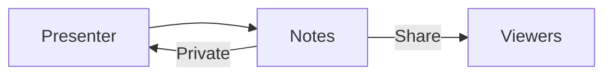

HoverBoard Notes is a local Markdown workspace for the material you need beside a presentation: speaker prompts, technical details, links, meeting notes, code snippets, and diagrams. It is private by default, which means the Notes window stays hidden from screen sharing until you explicitly choose **Share**.

## Open Notes

The default shortcut is **⌃⌥N**. You can also activate Notes from the menu bar or with the `hoverboard://activate/notes` command URL. Press the leader shortcut again or use the close control to dismiss it.

Notes can appear as a compact **Popup** card or a **Full screen** presenter view. Use Popup when you need a small prompt beside the app you are showing. Use Full screen when the notes themselves are the presentation or when you want a larger reading and editing surface.

## Write Markdown and see the result

Notes has a split Markdown editor and live preview. Write headings, lists, task lists, emphasis, links, inline code, and fenced code blocks in the source side. The preview renders the document as a readable page while you work.

Example:

````markdown
## Explain the trade-off

- Start with latency.
- Show the cache boundary.
- Ask for questions.

```swift
print("Hello HoverBoard")
```
````

The source editor includes syntax highlighting, while the preview is optimized for reading aloud and screen sharing when you intentionally enable Sharing.

## Add Mermaid diagrams

Mermaid is useful when a presenter needs a small flowchart without opening a separate diagram tool:

````markdown

````

The preview renders the diagram locally. Keep the source readable so you can edit the flow during preparation; use the rendered preview when the audience should see the result.

## Organize a local note library

Notes includes a local library with folders and search. Create folders by project, class, customer, or meeting series. Use short, searchable titles rather than keeping one enormous document for every presentation.

Autosave stores the library under the app’s local Application Support data. There is no account or cloud sync. If a note is important, export it or back up the local data as part of your normal Mac backup workflow.

## Private versus Sharing

The toolbar has a **Private / Sharing** control. Private is the default. In Private mode, HoverBoard configures the Notes window so screen-sharing systems do not include it. This is ideal for speaker prompts, reminders, unfinished thoughts, customer details, or a checklist that viewers should not see.

Choose **Share** only when you want the audience to see the rendered notes. Switch to Sharing before presenting a Markdown explanation, a Mermaid diagram, or a full-screen reading page. Switch back to Private as soon as the visible note section is finished.

This control is a presentation privacy boundary, not a replacement for good judgment. Do not put passwords or secrets into a note merely because the window is private.

## Popup or Full screen

Use **Popup** when:

- You need one short prompt while sharing another app.
- You want notes near the edge of the screen.
- You are switching between a demo and a quick reminder.

Use **Full screen** when:

- You are presenting the rendered document itself.
- The note contains a long lesson outline or Mermaid diagram.
- You want the audience to read the preview comfortably.

The toolbar can toggle the presentation size while Notes is open. The `hoverboard://action/notes-presentation` command is useful for Stream Deck or automation.

## Export a PDF

When a rendered note should become a handout or an archive, export it as a PDF from Notes. Export the rendered preview rather than the raw Markdown when the recipient needs a finished document. Keep the Markdown source when the note is still a living script.

## A presenter workflow

1. Create a folder for the project or session.
2. Write the outline in Markdown before the call.
3. Add Mermaid only where a visual flow is clearer than prose.
4. Open Notes in Popup mode and leave it **Private** while sharing another app.
5. Use the search or folder library to jump to the next prompt.
6. Switch to **Sharing** only for the section the audience should see.
7. Export a PDF after the session if a handout is useful.

## Trial and Pro access

Notes is a Pro feature with a 60-second trial each time you open it. Pro unlocks unlimited Notes use and PDF export alongside Whiteboard, Freeze, Cursor Halo, Keystroke Display, Sessions, and other advanced tools. Draw, Spotlight, and Break Timer remain free forever.

## Troubleshooting

### Notes are visible when they should be private

Check that the toolbar says **Private**, not Sharing. If you changed the sharing state while a call was already running, close and reopen the Notes window or verify what the meeting app is sharing.

### Mermaid is not rendering

Check the fenced block language: it must start with three backticks followed by `mermaid` and end with three backticks. Keep the diagram syntax simple while debugging and make sure each node and arrow is on a valid line.

### The note is not saved

Wait for the Saved indicator in the toolbar. If the issue persists, confirm the app can write to its Application Support directory and avoid force-quitting while a document is changing.

Notes is the quiet companion to every other HoverBoard tool: keep the script private, reveal only what helps the audience, and stay in the same presenting flow.
