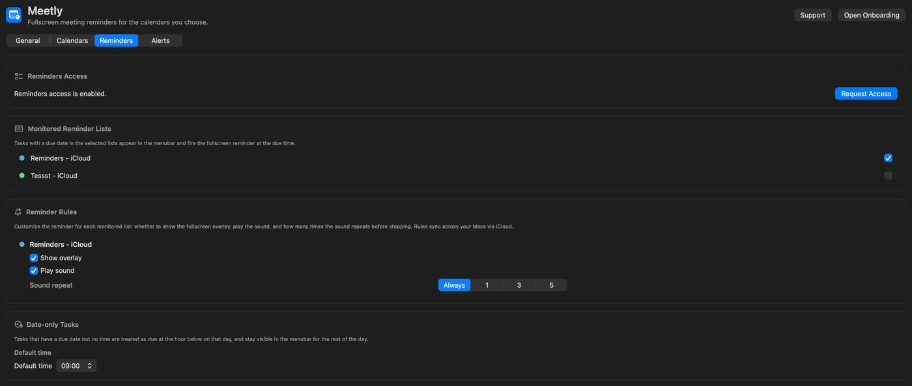

Meetings are not the only thing that disappears behind a coding session. **Meetly Pro** can watch **Apple Reminders** lists with due dates and fire the same **fullscreen overlay** you already use for calendar events.

This is a Pro feature. Free still covers one calendar, the overlay, and [Quick Panel](/blog/how-to-use-meetly-quick-panel/). Upgrade from the [Meetly pricing section](/meetly/#pricing) when you are ready.

## What Reminders integration does

- Select which **Reminders lists** Meetly monitors
- Tasks with a due **time** fire like meetings
- Tasks with a date but **no time** default to **9:00 AM** (configurable)
- Per-list overlay and sound rules
- State sync (dismiss / snooze / mute patterns) via **your iCloud** on Pro

Meetly does not replace the Reminders app. It interrupts you when a due item is about to hit — the same “wake up” moment as a calendar invite.

## Set up Reminders access

1. Open **Meetly → Settings → Reminders**.
2. Grant Reminders permission when macOS asks (or enable Meetly under **System Settings → Privacy & Security → Reminders**).
3. Toggle the lists you want monitored.
4. Adjust per-list overlay and sound rules.
5. Confirm status in **Settings → General → Health Check**.

Put high-stakes personal or work tasks on a dedicated list (“Due today”, “Ship blockers”) and leave shopping lists unmonitored.

## Due time vs date-only tasks

| Task type | Meetly behavior |
| --- | --- |
| Due date **and** time | Overlay fires before that time (using your global remind-before setting) |
| Due date, **no** time | Treated as the default time (9:00 AM unless you change it) |
| No due date | Ignored for overlays |

Keep times on anything that must interrupt you. Date-only tasks are easy to flood the morning with if every list is monitored.

## Same overlay, same join / dismiss habits

When a Reminders due fires, you get the familiar fullscreen UI: countdown, dismiss, snooze. There is usually no Zoom join button — these are tasks, not calls — but the interruption model matches meetings so muscle memory stays intact.

Combine with:

- [Mute and calendar rules](/blog/how-to-use-meetly-calendars-mute/) for calendar noise
- **Quiet hours (Pro)** under Alerts so overnight personal reminders stay soft
- **Hide during screen share (Pro)** when you present and still need private alerts

## Privacy

- Reminder contents are read on your Mac through Apple’s APIs.
- Meetly has **no backend** that stores your task titles or notes.
- Pro sync moves reminder **state** through **your iCloud**, not a codeonholiday server.

See the [Privacy Policy](/meetly/privacy.html) for the full wording.

## Troubleshooting

### No Reminders tab or lists empty

Confirm you are on **Pro**, Reminders permission is granted, and the lists actually contain due items.

### Too many morning overlays

Unmonitor noisy lists, or give date-only tasks a later default time. Prefer timed dues for anything critical.

### Reminder fired on one Mac but not another

Pro iCloud sync covers state; both Macs still need the same lists monitored and Reminders enabled in iCloud account settings.

## Related guides

- [Complete Meetly guide](/blog/how-to-use-meetly-complete-guide/)
- [Quick Panel](/blog/how-to-use-meetly-quick-panel/)
- [Calendars and mute](/blog/how-to-use-meetly-calendars-mute/)
- [Fullscreen calendar reminder roundup](/blog/best-fullscreen-calendar-reminder-macos/)
