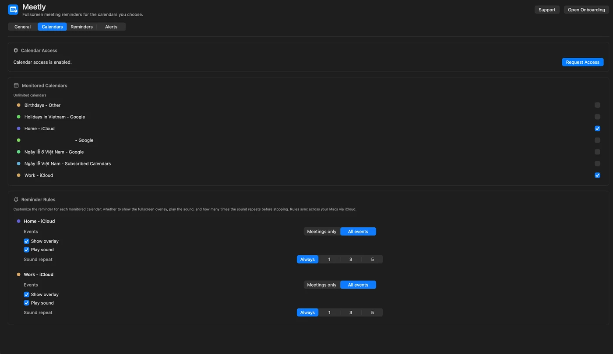
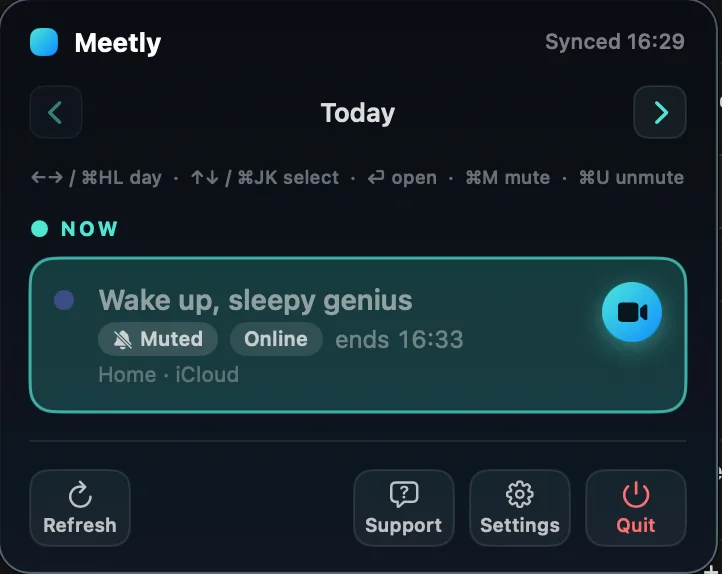

Meetly only works well when it watches the right calendars and stays quiet for the meetings you intentionally skip. This guide covers **Calendar access**, **monitored calendars**, **Pro reminder rules**, and **mute / unmute**.

Download Meetly from the [product page](/meetly/), or read the [complete guide](/blog/how-to-use-meetly-complete-guide/) for install and first launch.

## Grant Calendar access

On first launch, Meetly asks for Calendar permission. If you denied it:

1. Open **Settings → Calendars**.
2. Click **Request Calendar Access**, or enable Meetly under **System Settings → Privacy & Security → Calendars**.
3. Run **Settings → General → Health Check** to confirm permission and the next reminder.

Meetly reads events that already appear in **macOS Calendar** — Google, Outlook, iCloud, Exchange, and other accounts you synced there. It does not replace your calendar app.

## Choose monitored calendars

**Free** monitors **one** calendar. **Pro** unlocks unlimited calendars.

1. Open **Settings → Calendars**.
2. Toggle **Monitored Calendars** for each source you care about.
3. Leave personal noise calendars off if you only want work alerts.

## Pro reminder rules per calendar

On Pro, each monitored calendar has rules:

- Meetings only vs all events
- Show overlay on / off
- Play sound on / off
- Sound repeat count

Use this when one calendar is “must interrupt” (customer calls) and another is “glance only” (optional social). Pair rules with [Alert settings](/blog/how-to-use-meetly-complete-guide/) such as remind-before timing and quiet hours.

## Mute a single meeting

Mute is for one occurrence you do not want a fullscreen reminder for — an optional sync, a duplicate invite, or a standup you are skipping.

1. Open the **menu bar panel** or [Quick Panel](/blog/how-to-use-meetly-quick-panel/) (⌃⌥M).
2. Select the meeting.
3. Press **⌘ M**.

A **Muted** tag appears on the event. Press **⌘ U** to unmute.

| Action | Meaning |
| --- | --- |
| **Mute (⌘ M)** | Skip the fullscreen reminder for this occurrence |
| **Snooze** | Delay the current overlay |
| **Dismiss** | Clear the current overlay |

Mute is not the same as deleting the event from Calendar. The meeting still shows in the list; Meetly simply will not interrupt you for it.

On **Pro**, mute state syncs across your Macs through **your iCloud** — not a codeonholiday server.

## Only remind meetings with a join link

In **Settings → Alerts**, enable **Only remind meetings with a join link** if in-person or room-only events should stay silent. That filter works together with mute and calendar rules.

## Troubleshooting empty or wrong reminders

1. Health Check — Calendar access granted?
2. Is the event’s calendar monitored?
3. Is the meeting muted?
4. Are quiet hours (Pro) hiding overlays overnight?
5. Free plan — is a second calendar silently unmonitored?

## Related Meetly guides

- [Quick Panel keyboard workflow](/blog/how-to-use-meetly-quick-panel/)
- [Apple Reminders on Pro](/blog/how-to-use-meetly-apple-reminders/)
- [Complete Meetly guide](/blog/how-to-use-meetly-complete-guide/)
- [Best meeting reminder apps for macOS](/blog/best-meeting-reminder-app-macos/)
