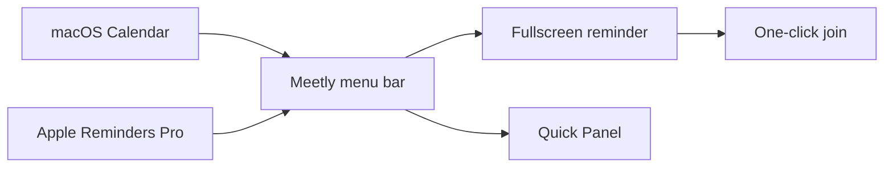
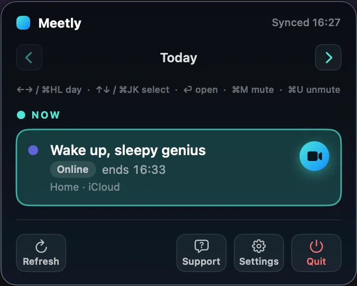
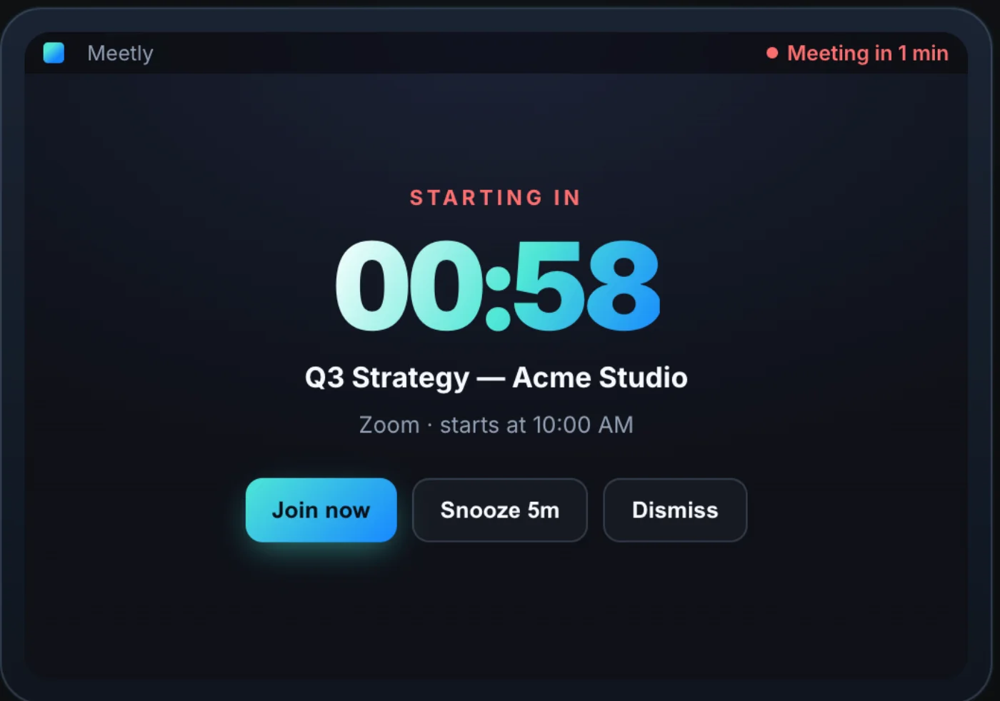
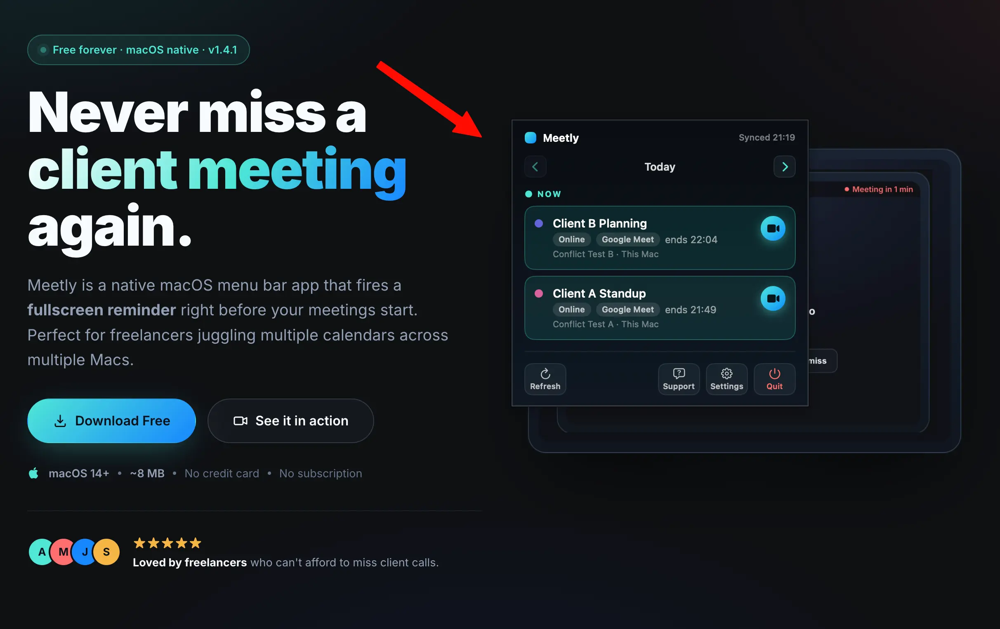

Meetly is a native macOS menu bar app that fires a **fullscreen reminder** before your meetings start — then gets out of your way. It is not a calendar replacement. It watches the calendars you already use (Google, Outlook, iCloud, Exchange, and anything synced into macOS Calendar) and interrupts you at the right moment.

This guide walks through install, first launch, daily use, keyboard shortcuts, settings, and Pro features. If you have not downloaded it yet, grab it from the [Meetly page](/meetly/).

## What Meetly does (and does not do)

**Meetly does:**

- Show a fullscreen overlay before a meeting starts
- Surface one-click join links for Zoom, Google Meet, Teams, and similar
- Live in the menu bar with a quick glance at today and the week ahead
- Let you mute specific meetings, snooze, or dismiss from the keyboard

**Meetly does not:**

- Replace Calendar, Fantastical, or Google Calendar on the web
- Upload your calendar data to our servers — everything stays on your Mac (sync state uses your own iCloud on Pro)
- Charge a monthly subscription — Free is free forever; Pro is a one-time purchase

## Requirements

- **macOS 14 (Sonoma) or later**
- Calendar accounts already set up in the macOS **Calendar** app
- About 8 MB of disk space — Meetly is a lightweight native app, not Electron

## Install and first launch

1. [Download Meetly](/meetly/) and unzip the archive.
2. Drag **Meetly.app** into Applications (or run it from the folder).
3. On first open, macOS may ask you to confirm — choose **Open**.
4. The **setup window** appears right away (as of v1.4.5). You may briefly see Meetly in the Dock during setup; that is normal.
5. When setup finishes, Meetly lives in the **menu bar** at the top-right of your screen — look for the calendar icon. There is **no Dock icon** after setup.

> **Opened Meetly and nothing happened?** Meetly is a menu bar app. Click the calendar icon in the menu bar. If you do not see it, check the menu bar overflow (» or Control Center extras).

## First-time setup (onboarding)

Onboarding has two steps:

### Step 1 — Choose calendars

1. Click **Request Calendar Access** and allow Calendar permission in the system dialog.
2. Toggle on the calendars Meetly should watch.
   - **Free:** one calendar
   - **Pro:** unlimited calendars
3. Pick the calendar that matters most if you are on Free — usually your work calendar.

### Step 2 — Test the reminder

1. Click **Create Test Reminder** — Meetly adds a meeting that starts in 30 seconds.
2. Or click **Show Fullscreen Test** to preview the overlay immediately (after a test meeting exists).
3. When you have seen the overlay, click **Finish**.

You can reopen onboarding anytime from **Settings → Open Onboarding**.

## Where Meetly lives: the menu bar

Click the calendar icon to open the menu bar panel. On **Today** you will see:

| Section | What it shows |
|---------|----------------|
| **NOW** | Meetings happening right now |
| **NEXT** | The next meeting today (with countdown — e.g. `in 1:12` when more than an hour away) |
| **UPCOMING** | Later meetings today |

Use the **‹ ›** arrows to browse the next six days. Each day shows a flat list of that day’s events.

Footer actions:

- **Refresh** — reload events from Calendar
- **Settings** — calendars, alerts, shortcuts, Pro
- **Quit** — exit Meetly (it will not remind you until you launch it again)

The same keyboard shortcuts as Quick Panel work here too — arrows or **⌘ H / J / K / L** to navigate, **⌘ M** / **⌘ U** to mute/unmute.

**Tip:** Turn on **Launch Meetly at login** in Settings → General so reminders work after every reboot.

## The fullscreen reminder

Before a meeting starts (default: **10 seconds** ahead, configurable), Meetly covers **every connected display** with a fullscreen overlay:

- Meeting title and time
- **Join now** if a video link is detected
- **Snooze** for 1, 3, or 5 minutes
- **Dismiss** to skip this occurrence

The overlay auto-dismisses after a few minutes (default **3 minutes**) if you do not act. Joining from the overlay always dismisses it. Joining early from the menu bar can optionally dismiss it too — see Settings → Alerts.

### Keyboard shortcuts on the overlay

| Key | Action |
|-----|--------|
| **← →** or **↑ ↓** | Move focus between Join, Snooze, Dismiss |
| **Return** | Activate the focused button |
| **Esc** | Dismiss |

If two meetings overlap, the overlay lists both. Use arrow keys to pick which one to join.

### One-click join

If the calendar event has a conferencing URL, Meetly surfaces **Join now** — no digging through Calendar notes.

## Quick Panel — your schedule from anywhere

Press **Control + Option + M** (default) from any app to summon the **Quick Panel** at your cursor. It shows the same meeting list as the menu bar, without clicking the icon.

| Key | Action |
|-----|--------|
| **← →** or **⌘ H / ⌘ L** | Change day |
| **↑ ↓** or **⌘ K / ⌘ J** | Select a meeting |
| **Return** | Join / copy location / open link |
| **⌘ M** | Mute selected meeting (skip fullscreen reminder) |
| **⌘ U** | Unmute selected meeting |
| **Esc** | Close panel |

**Vim-style:** **⌘ H** previous day, **⌘ L** next day, **⌘ K** up, **⌘ J** down — same as the arrow keys while the panel is open.

Change the shortcut in **Settings → General → Quick Panel Shortcut**. You can record any key combo the recorder accepts.

## Mute and unmute meetings

Sometimes you want to skip the fullscreen alert for one meeting — standup you are intentionally skipping, a optional sync, a duplicate invite.

1. Open the menu bar panel or Quick Panel.
2. Select the meeting.
3. Press **⌘ M** to mute.

Muted meetings show a **Muted** tag. Press **⌘ U** to turn reminders back on.

Mute is separate from dismiss or snooze: it means “do not fire the fullscreen reminder for this occurrence.” On **Pro**, mute state syncs across your Macs via iCloud.

## Settings overview

Open **Settings** from the menu bar panel. There are four tabs.

### General

- **Meetly Pro** — license and upgrade
- **Launch at login**
- **Quick Panel shortcut** — enable/disable and customize
- **Health Check** — permissions, monitored calendars, next reminder, sync status
- **Software Update** — Sparkle auto-update

### Calendars

- **Request Calendar Access** if permission was denied
- **Monitored Calendars** — toggle which calendars to watch
- **Reminder Rules (Pro)** — per calendar:
  - Meetings only vs all events
  - Show overlay on/off
  - Play sound on/off
  - Sound repeat count (Pro)

### Reminders (Pro)

Watch **Apple Reminders** lists with due dates:

- Select which lists to monitor
- Tasks with a due **time** fire like meetings
- Tasks with a date but **no time** default to **9:00 AM** (configurable)
- Per-list overlay and sound rules, synced via iCloud

### Alerts

| Setting | What it does |
|---------|----------------|
| **Remind before** | 10s, 30s, 1 min, or 5 min |
| **Auto dismiss overlay** | 1, 3, or 5 minutes |
| **Only remind meetings with a join link** | Skip in-person / room-only events |
| **Dismiss when joining from menu bar** | On = early join skips overlay; Off = safer if you join early then get distracted |
| **Quiet hours (Pro)** | Mute fullscreen reminders overnight |
| **Hide during screen share (Pro)** | Overlay visible to you, hidden from Zoom/Meet/Teams viewers |
| **Test reminders** | Create 30s test meetings or show overlay instantly |

## Meetly Pro

Free covers one calendar, fullscreen reminders, Quick Panel, and mute shortcuts — enough for many people.

**Pro** (one-time purchase, no subscription) adds:

- Unlimited calendars
- Apple Reminders integration
- Per-calendar and per-list reminder rules
- iCloud sync for dismiss, join, snooze, and mute across Macs
- Quiet hours
- Hide overlay during screen sharing
- Sound repeat limits per calendar

Enter or buy a license from **Settings → Meetly Pro** or the upgrade row in the menu bar.

## Multi-monitor setups

Meetly creates one overlay window per display. As of **v1.4.6**, the fullscreen reminder covers **all connected monitors** correctly — not just the main screen.

## Privacy and data

- Meetly has **no backend server** for your calendar data.
- Events are read from macOS Calendar / Reminders on your machine.
- Pro sync stores reminder **state** (dismissed, snoozed, muted) in **your iCloud** — not on codeonholiday servers.
- Nothing is sold or shared.

## Troubleshooting

### Meetly is not reminding me

1. **Settings → Health Check** — is Calendar access granted?
2. Is at least one calendar selected in **Calendars**?
3. Is the meeting on a monitored calendar?
4. Is the meeting muted (Muted tag in the list)?
5. Are **quiet hours** enabled (Pro)?
6. Is **Only remind meetings with a join link** on, but the event has no URL?
7. Did you dismiss or snooze this occurrence already?

### Calendar permission denied

Go to **System Settings → Privacy & Security → Calendars** and enable Meetly. Then **Settings → Calendars → Request Access**.

### Overlay only on one screen / half screen

Update to **v1.4.6** or later. Older builds had a multi-monitor sizing bug.

### Quick Panel shortcut does nothing

Check **Settings → General → Enable global shortcut** is on. Another app may have claimed the same combo — record a different shortcut.

### Double reminders on two Macs

Upgrade to **Pro** and sign into iCloud on both machines. Dismiss on one Mac should sync to the other.

## Recommended workflow

1. **Install** and finish onboarding with your main work calendar.
2. **Enable launch at login.**
3. **Run a test reminder** so you know what the overlay feels like.
4. **Learn ⌃⌥ M** for Quick Panel and **⌘ M** to mute optional meetings.
5. **Upgrade to Pro** if you use multiple calendars, Reminders, or more than one Mac.

## Get help

- [Meetly product page](/meetly/) — download, FAQ, pricing
- **Settings → Support** — opens Telegram support
- [Why I built Meetly](/blog/why-i-built-meetly-after-i-kept-missing-daily-standup/) — the story behind the app

Meetly exists so you can work deeply and still show up on time. Set it up once, trust the interrupt, and stop watching the clock.
