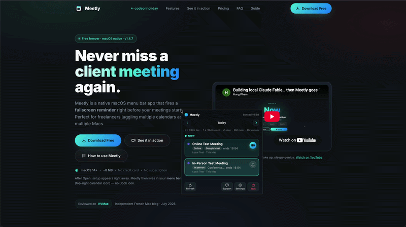

Meetly’s **Quick Panel** is the fastest way to see today’s meetings without hunting for the menu bar icon. Press a global shortcut from any app and the same schedule list appears at your cursor — ready to join, mute, or browse another day.

If you are new to Meetly, start with the [complete Meetly guide](/blog/how-to-use-meetly-complete-guide/) or download from the [Meetly page](/meetly/).

## Open the Quick Panel

The default shortcut is **Control + Option + M** (⌃⌥M).

1. Grant Accessibility / Input Monitoring if macOS asks on first use of the global shortcut.
2. Press **⌃⌥M** from Safari, your IDE, Slack, or anywhere else.
3. The panel opens at the pointer with today’s meetings.

Change the combo anytime in **Settings → General → Quick Panel Shortcut**. Disable the global shortcut there if you only want the menu bar.

## Keyboard shortcuts

| Key | Action |
| --- | --- |
| **← →** or **⌘ H / ⌘ L** | Change day |
| **↑ ↓** or **⌘ K / ⌘ J** | Select a meeting |
| **Return** | Join / copy location / open link |
| **⌘ M** | Mute selected meeting (skip fullscreen reminder) |
| **⌘ U** | Unmute selected meeting |
| **Esc** | Close panel |

**Vim-style navigation** (**⌘ H J K L**) mirrors the arrow keys while the panel is focused. That matters when you live in the terminal or an editor and do not want to reach for the mouse.

## Join a call in one press

Highlight a meeting that has a Zoom, Google Meet, or Teams link, then press **Return**. Meetly opens the join URL the same way the menu bar and fullscreen overlay do.

If the event only has a location string, Return may copy or open that location instead — useful for room names and conference bridges.

## Mute optional meetings from the panel

Optional syncs and standups you are skipping should not interrupt deep work. Select the event and press **⌘ M**. A **Muted** tag appears. **⌘ U** turns reminders back on.

Mute means “do not fire the fullscreen reminder for this occurrence.” It is separate from snooze or dismiss. On **Pro**, mute state syncs across your Macs via iCloud. More detail: [How to mute meetings and manage calendars in Meetly](/blog/how-to-use-meetly-calendars-mute/).

## When to use Quick Panel vs the menu bar

| Situation | Prefer |
| --- | --- |
| Hands already on the keyboard | Quick Panel (⌃⌥M) |
| Glancing at the clock area | Menu bar icon |
| Multi-day browse while coding | Quick Panel + ⌘ H / L |
| Opening Settings / Health Check | Menu bar → gear |

Both surfaces share the same meeting list, mute shortcuts, and join behavior. Pick the one that keeps your flow.

## Troubleshooting

### Shortcut does nothing

1. **Settings → General** — confirm the global shortcut is enabled.
2. Another app may own the same combo — record a different shortcut.
3. Re-check Accessibility permission for Meetly in **System Settings → Privacy & Security**.

### Panel is empty

Confirm Calendar access and that at least one calendar is monitored. See [calendars and mute](/blog/how-to-use-meetly-calendars-mute/) or run **Settings → Health Check**.

## Next steps

- Learn the [fullscreen reminder overlay](/blog/how-to-use-meetly-complete-guide/) so you never miss a hard start time.
- Connect [Apple Reminders on Pro](/blog/how-to-use-meetly-apple-reminders/) so due tasks fire the same alert style.
- Compare Meetly with [MeetingBar](/blog/meetly-vs-meetingbar/) if you came from a menu-bar-only join tool.
