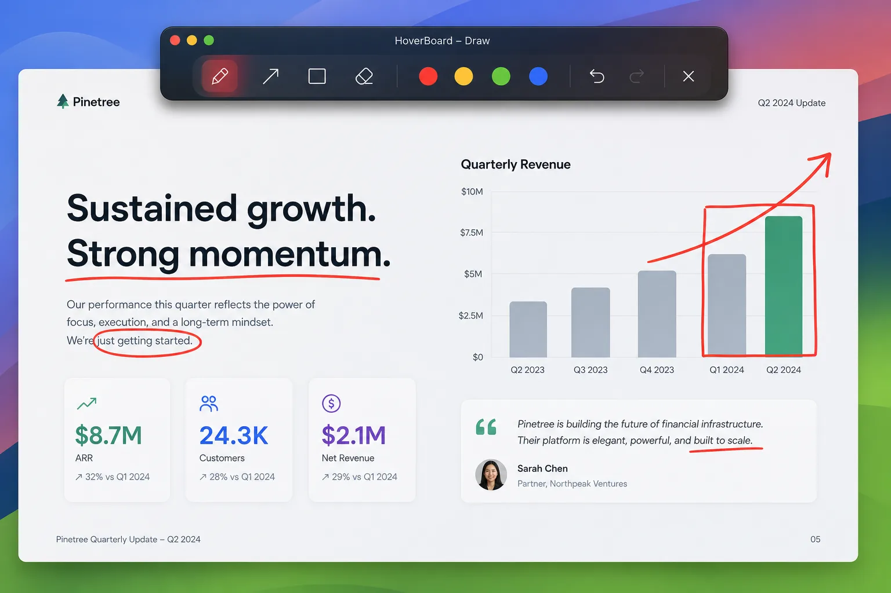
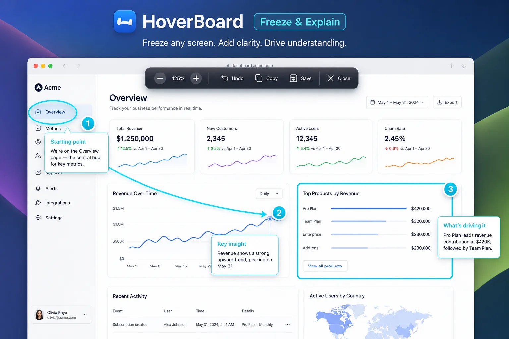
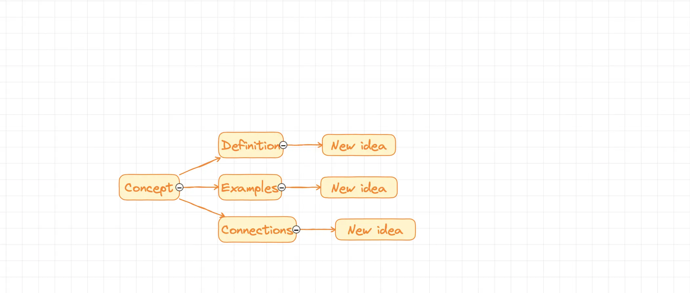
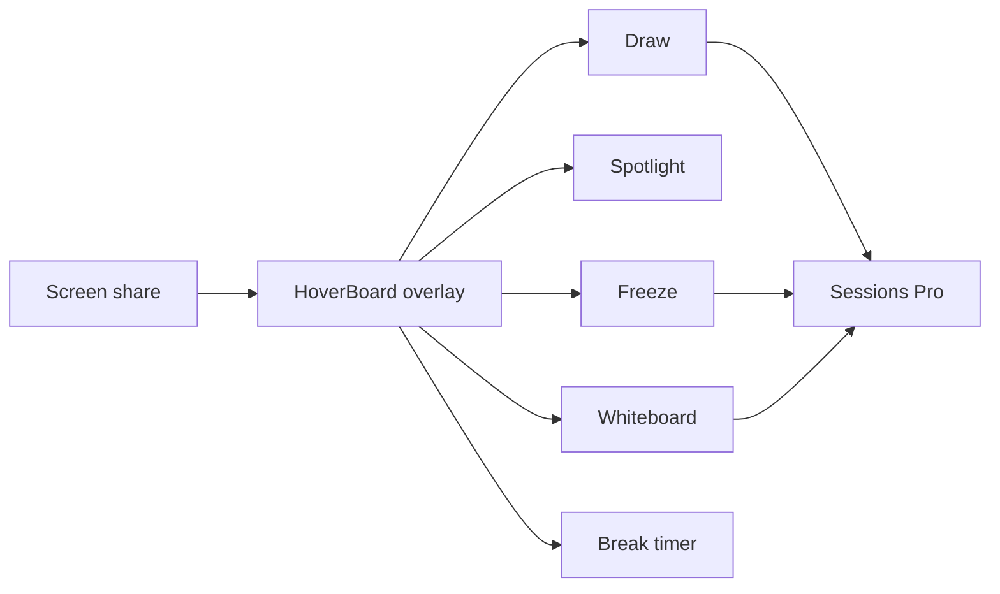

I didn’t set out to build a presentation suite. I set out to stop breaking my own screen share mid-sentence.

If you’ve ever said “one second, let me switch apps” on Zoom, Meet, or Teams — then come back to a quiet room and a lost thread — you already know the pain. That friction is why [HoverBoard](/hoverboard/) exists.

**New here?** Start with the [How to Use HoverBoard complete guide](/blog/how-to-use-hoverboard-complete-guide/) — install, every mode, hotkeys, free vs Pro, and troubleshooting.

## The mid-call shuffle

I present a lot. Training sessions, demos, walkthroughs of whatever is on screen.

The pattern was always the same:

1. I’m sharing a slide, a browser, or an IDE
2. Someone asks a question that needs a circle, an arrow, or a freeze
3. I alt-tab into another annotation tool (or worse, stop sharing)
4. By the time I’m back, half the room has checked Slack

Tools that *can* draw over the screen usually want to be the main event — a separate window, a separate mode, a separate mental context. I didn’t need theater software. I needed a thin overlay that respected whatever I was already sharing.

## What “good enough” wasn’t

Keyboard screenshots and Markup. Sticky notes. A second display for a whiteboard. A browser timer in another tab for breaks.

Each of those “works” once. None of them work when you’re live and the next beat of the workshop is already waiting.

What I actually needed:

1. **Draw on top of anything** — without leaving the share
2. **Spotlight / cursor emphasis** — so people stop asking “where?”
3. **Freeze the frame** when the UI is about to change under me
4. **A real whiteboard / mindmap** when the conversation leaves the deck
5. **A break timer** that the room can see — not one I forget in Notes
6. **Hotkeys** — because hunting a menu mid-sentence is how you lose the room

That list became HoverBoard’s design constraints.

## Building HoverBoard as an overlay

HoverBoard lives in the macOS menu bar. Every tool is a hotkey away. Try any tool free for 30 seconds; unlock the full app with a one-time Pro license — no subscription.

### See it in action

A short demo of draw, spotlight, and the overlay flow:

:::youtube https://youtu.be/jbJOG-OBTqA
:::

### Draw in the moment

Pen, highlighter, laser, arrows, shapes — annotate live over whatever you’re sharing. Auto-fade or keep until you dismiss.

### Spotlight so people follow your pointer

Dim the screen and leave a soft spotlight on the cursor. Click-through stays enabled so you can still interact with the app underneath.

### Freeze when the screen is about to move

Lock a frame so you can talk about what’s on screen without the UI changing under you — useful for live demos and flaky UIs.

### Whiteboard and mindmap without leaving the call

Open an infinite whiteboard for side discussions, then come back. Mindmap nodes, fountain pen, collapse branches — still an overlay, still hotkey-driven.

### Breaks that the room can see

Set a countdown — fullscreen or corner — so “five minutes” stays five minutes.

## How the pieces fit together

Pro also adds **Sessions**: capture frames from Draw, Freeze, or Whiteboard into a local library, reorder them, and export PNG set or multi-page PDF — everything stays on your Mac.

## What changed once I stopped switching apps

The metric wasn’t feature count. It was interruptions.

Fewer “wait, let me open…” moments. Fewer lost questions. Longer stretches where I could stay in the material and let the overlay do the visual work.

HoverBoard isn’t meant to replace Keynote or your deck. It’s the layer *on top* when the conversation leaves the slide.

## Who it’s for

HoverBoard is for people who:

- Present or train over Zoom / Meet / Teams on a Mac
- Hate breaking screen share just to circle something
- Want hotkeys over another floating toolbox you’ll never learn
- Prefer a one-time license and local-first Sessions over another SaaS

## Try it

[Download HoverBoard](/hoverboard/). Every tool has a 30-second free trial so you can feel the interrupt mid-share before you buy. Pro is a one-time unlock — no subscription.

I built it because presenting meant switching apps. I kept shipping it because the overlay turned out to be the whole product — not a feature bolted onto something else.
