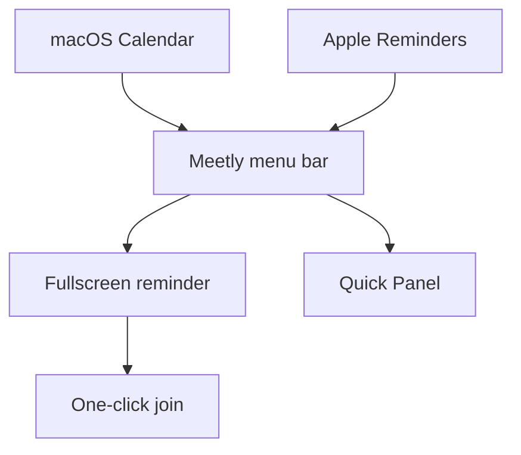

I didn’t set out to build a meeting app. I set out to stop being *that* person who slides into standup three minutes late with “sorry, lost track of time.”

If you work remotely — or hop between deep work and a stack of calendars — you already know the pattern. This is the story of how that pattern became [Meetly](/meetly/).

## The standup I kept missing

Daily standup is short. That’s the trap.

It’s fifteen minutes on the calendar, same time every day, nothing dramatic about it. Easy to treat as background noise — until you’re heads-down in a bug, headphones on, and the banner on the corner of the screen never quite wins.

I wasn’t ignoring meetings on purpose. I was optimizing for focus. The side effect was embarrassing: joining late, apologizing, losing the thread of what the team just synced on.

One week I missed standup twice. That was enough.

## Why macOS calendar alerts weren’t enough

I already had calendars set up. Google, work, personal — all synced into macOS Calendar. Notifications were “on.”

Here’s what actually happened in practice:

- A tiny banner appears in the corner for a few seconds, then vanishes
- Notification Center stacks it with everything else
- Focus Mode / Do Not Disturb quietly bury it when I’m deep in work
- Multiple calendars mean noise — important meetings compete with optional ones

A notification that you can ignore *will* be ignored when you’re in flow. That’s not a character flaw. That’s how attention works on a laptop full of context.

I didn’t need another calendar. I needed something that treated the next meeting like a hard interrupt — polite, but impossible to miss.

## What I actually needed

I wrote down a short list before writing any code:

1. **See it before it starts** — not when the call already began
2. **Fullscreen, not a corner toast** — take over the screen for a moment
3. **One-click join** — Zoom, Meet, Teams links without digging in Calendar
4. **Live in the menu bar** — always there, never another window to manage
5. **Stay on my Mac** — no account, no cloud dashboard for calendar data I already own

That list became Meetly’s design constraints. Everything else was optional until those five felt solid.

## Building Meetly around the interrupt

Meetly is a native macOS menu bar app. Before a meeting starts, it fires a **fullscreen reminder** — title, time, and a clear path to join.

### See it in action

Here’s a short demo of the fullscreen reminder and one-click join:

:::youtube https://youtu.be/nbrieBO4OTs
:::

The point isn’t to be loud for its own sake. It’s to create a reliable ritual: *when the overlay appears, you either join or consciously dismiss.* No ambiguous “maybe I saw a banner.”

### Menu bar, always one glance away

Between meetings, Meetly sits quietly in the menu bar — what’s next, when it starts, jump in when you need to.

### Quick Panel for the day ahead

When you want the bigger picture without opening Calendar, Quick Panel shows what’s coming up so you can plan deep work around the hard edges of your schedule.

### One-click join

If the event has a conferencing link, Meetly surfaces it. The reminder shouldn’t send you hunting through Calendar notes while the call is already greening up.

## How the pieces fit together

If it shows up in Calendar — Google, Outlook, iCloud, Exchange — Meetly can watch it. Pro unlocks more calendars, Apple Reminders with due dates, and iCloud sync for settings across Macs. Free stays useful on its own: one calendar, fullscreen reminders, no subscription treadmill.

## What changed after I started using it

The metric that mattered wasn’t downloads. It was standup.

I stopped building a “I’ll remember” system in my head. The overlay became the system. Late joins dropped. Apologies dropped. I could go deep on work *because* I trusted the interrupt would fire when it mattered.

That’s the irony of a good meeting reminder: it protects focus. You don’t half-watch the clock. You work until Meetly says it’s time.

## Who Meetly is for

Meetly is for people who:

- Live in multiple calendars and still miss the one meeting that happens every day
- Use macOS and want something native — not another Electron tab
- Want a one-time purchase path (Pro) instead of monthly SaaS guilt
- Care that calendar data stays on their Mac / their iCloud — not our servers

If your standup never slipped, you might not need this. If it has — you’ll recognize the problem in the first overlay.

## Try it

[Meetly is free to download](/meetly/). Fullscreen reminders on one calendar cost nothing. Upgrade to Pro if you need more calendars, Reminders, or sync across machines — one-time, no subscription.

I built it because I kept missing daily standup. I kept shipping it because the interrupt turned out to be useful for *every* meeting I actually care about — not just the recurring fifteen minutes that started it all.
